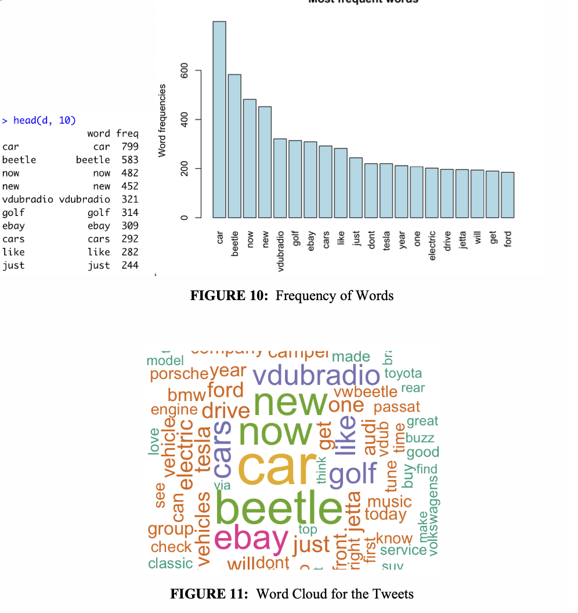
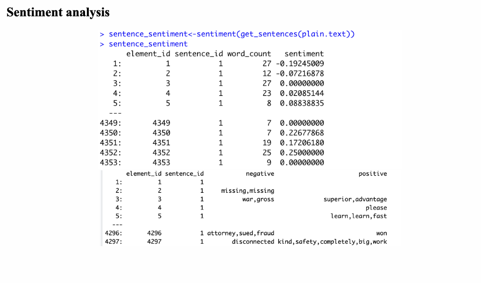
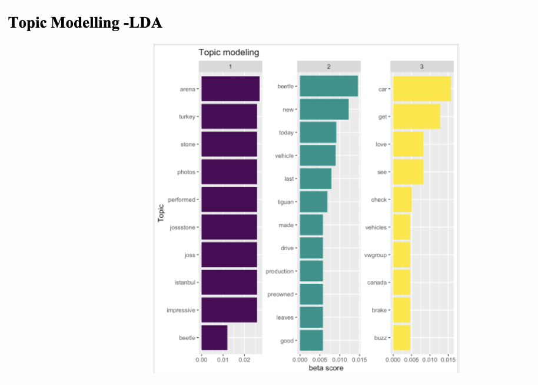

# 🐦 Twitter Sentiment & Topic Analysis App

This project is a **text mining and sentiment analysis** dashboard built in R. It fetches real-time tweets about **Volkswagen** via Twitter API, analyzes their sentiment, and visualizes the results including word frequency, word clouds, sentiment scores, and topic modeling (LDA).

## 📌 Features

- 🐤 Collect tweets using `rtweet`
- 📊 Clean and preprocess text data using `tm`
- 🔠 Visualize word frequency and word clouds
- 💬 Perform sentiment analysis using `sentimentr`
- 🧠 Topic modeling using Latent Dirichlet Allocation (LDA)

---

## 📂 Dataset

Tweets were collected using the following query:
Language: English  
Count: 18,000 tweets  
Duplicates and retweets were removed.

---

## 🔍 Text Analysis Visuals

### 📊 Word Frequency and Word Cloud

---

### 💬 Sentiment Table

Each sentence was evaluated and tagged with a sentiment score.  
Here’s a sample output of top and bottom tweets:

---

### 🧠 Topic Modeling - LDA

Three major topics discovered from the tweet dataset:

---

## 🛠️ Dependencies

Main R packages used:

- `rtweet`
- `tm`, `wordcloud`, `ggplot2`, `dplyr`, `reshape2`
- `sentimentr`
- `topicmodels`
- `tidytext`, `magrittr`, `data.table`, `rvest`

---

## 🧠 Insights

- The overall sentiment for Volkswagen tweets was **neutral to slightly positive**.
- Most frequent words include: `car`, `beetle`, `now`, `ebay`.
- Topic modeling reveals clusters about **new vehicle models**, **user experiences**, and **product features**.

---

## 📄 License

This project is intended for portfolio demonstration purposes only.  

---
